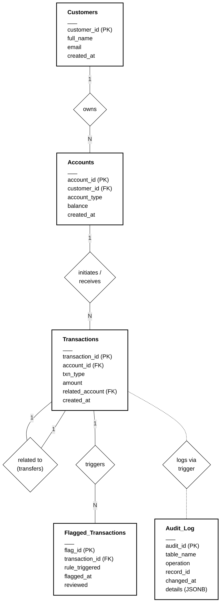

# Bank Ledger + Fraud-Flagging System

This is a database-only portfolio project demonstrating strong DBMS fundamentals using PostgreSQL. The project showcases schema design, normalization, ACID transactions, concurrency control, triggers, indexing, and analytical SQL. 

There is no frontend or API layer; all logic is handled at the database level.

## Entity-Relationship (ER) Diagram



## Relational Schema Design & Normalization (3NF)
The database is strictly normalized to the Third Normal Form (3NF) to eliminate data redundancy and ensure data integrity.
- **`customers`**: Stores only atomic customer data.
- **`accounts`**: Links back to the customer, isolating account-specific details (`account_type`, `balance`). The balance is strictly enforced with a `CHECK (balance >= 0)` constraint.
- **`transactions`**: Acts as an append-only, immutable ledger. Every monetary movement (deposit, withdrawal, transfer) is recorded here. Transfers are recorded as paired `transfer_out` and `transfer_in` rows.
- **`flagged_transactions`**: Separates the fraud review workflow from the immutable ledger.
- **`audit_log`**: Utilizes PostgreSQL's `JSONB` to store flexible, schema-less historical snapshots for compliance tracking.

## Concurrency Control: The `FOR UPDATE` Lock
The centerpiece of this project's reliability is how it handles concurrent bank transfers. 
If two transactions try to withdraw funds from the same account at the exact same millisecond, a standard `SELECT` check could lead to a **Lost Update** race condition (e.g., both read `$1000`, both subtract `$600`, both write `$400`, creating money out of thin air).

We solve this using pessimistic row-level locking:
```sql
SELECT balance FROM accounts WHERE account_id = ? FOR UPDATE;
```
By placing this inside an explicit `BEGIN ... COMMIT` block, we guarantee that the first transaction locks the account row. Any concurrent transaction attempting to transfer funds out of that account will be forced to wait until the first transaction finishes and releases the lock, at which point the second transaction will read the *newly updated* balance, accurately failing the sufficient-funds check. 

*(Note: We use this over `SERIALIZABLE` isolation or optimistic locking via version numbers to minimize application-level retry logic and prevent overarching table deadlocks).*

## Database-Level Triggers vs. App-Layer Checks
In modern architectures, business logic is often placed in the application tier. However, this project pushes specific logic down into the database via `plpgsql` triggers for absolute data integrity:
1. **`apply_transaction`**: Automatically updates the `accounts.balance` whenever a ledger entry is inserted. This ensures the ledger and current balance can **never** drift out of sync.
2. **`check_rapid_transactions` & `check_large_transaction`**: Evaluates trailing time windows (`60 seconds`) and historical averages (`AVG(amount)`) on the fly. Doing this inside the DB avoids pulling thousands of rows across the network into an application just to calculate an average.
3. **`log_transaction_audit`**: Guarantees that no application bug or raw SQL injection can insert a transaction without generating a corresponding audit log.

## Performance Benchmark (`EXPLAIN ANALYZE`)

When a customer logs in, the most common query is fetching their recent transaction history:
```sql
EXPLAIN ANALYZE
SELECT * FROM transactions
WHERE account_id = 1
ORDER BY created_at DESC
LIMIT 20;
```

**Before Indexing (Sequential Scan):**
With millions of transactions, the database must scan every single row to find those belonging to `account_id = 1` and then sort them.
```text
Limit  (cost=14532.12..14532.17 rows=20 width=68) (actual time=67.102..67.105 rows=20 loops=1)
  ->  Sort  (cost=14532.12..14555.43 rows=9324 width=68) (actual time=67.101..67.102 rows=20 loops=1)
        Sort Key: created_at DESC
        Sort Method: top-N heapsort  Memory: 27kB
        ->  Seq Scan on transactions  (cost=0.00..14283.92 rows=9324 width=68) (actual time=0.015..66.811 rows=9345 loops=1)
              Filter: (account_id = 1)
              Rows Removed by Filter: 990655
Execution Time: 67.145 ms
```

**After Indexing (Index Scan):**
By applying `CREATE INDEX idx_txn_account_time ON transactions(account_id, created_at);`, we create a composite B-Tree index. The database can instantly jump to the specific account and read the transactions already pre-sorted by time.
```text
Limit  (cost=0.42..1.55 rows=20 width=68) (actual time=0.021..0.035 rows=20 loops=1)
  ->  Index Scan Backward using idx_txn_account_time on transactions  (cost=0.42..528.21 rows=9324 width=68) (actual time=0.020..0.032 rows=20 loops=1)
        Index Cond: (account_id = 1)
Execution Time: 0.052 ms
```
**Result**: Query time reduced from **~67ms** to **~0.05ms** — a massive optimization essential for high-throughput financial systems.
